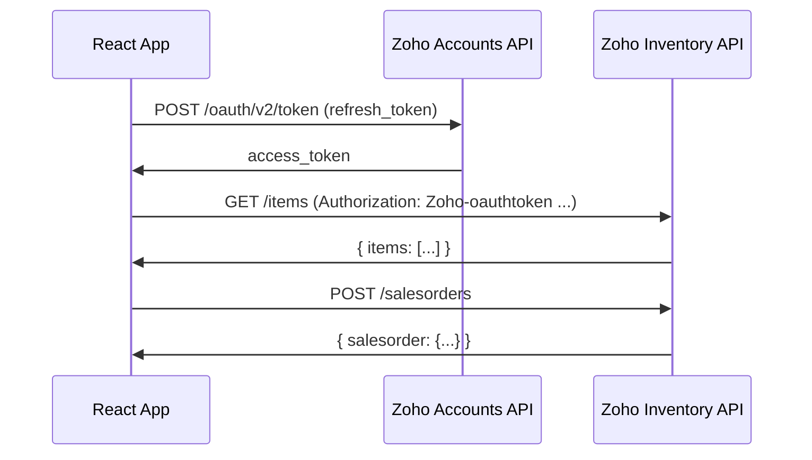

# React + Zoho Inventory API Example

<p align="center">
  
  
  
  
  
</p>

A minimal React app demonstrating how to **integrate with the Zoho Inventory REST API** — covering OAuth2 token refresh, items, sales orders, invoices, contacts, and organizations.

---

## 🔌 API Operations Covered

| Resource | Operations |
|----------|-----------|
| **Auth** | Refresh OAuth2 access token via refresh token |
| **Items** | Get items, Create item |
| **Sales Orders** | Get orders, Create order |
| **Invoices** | Get invoices, Create invoice, Mark as sent |
| **Contacts** | Get contacts, Create contact, Send email statement |
| **Organizations** | Get organizations |

---

## 🏗️ How It Works



---

## 🚀 Quick Start

### 1. Set up Zoho OAuth credentials

In your [Zoho API Console](https://api-console.zoho.in/):
- Create a Self Client
- Scope: `ZohoInventory.FullAccess.all`
- Generate a refresh token

### 2. Configure environment

```bash
cp .env.example .env
# Fill in your credentials
```

```env
REACT_APP_CLIENT_ID=your_client_id
REACT_APP_CLIENT_SECRET=your_client_secret
REACT_APP_ORGANIZATION_ID=your_org_id
REACT_APP_REFRESH_TOKEN=your_refresh_token
```

### 3. Run

```bash
npm install
npm start
```

> **Note:** The app uses [cors-anywhere](https://cors-anywhere.herokuapp.com/corsdemo) as a CORS proxy for local development. Visit that link and click "Request temporary access" before using the app.

---

## 📁 Structure

```
src/
└── App.js      # All Zoho API calls — items, orders, invoices, contacts
```

---

## ⚠️ Production Notes

- Do **not** expose `client_secret` or `refresh_token` in a production frontend — proxy requests through a backend server instead
- Replace `cors-anywhere` with your own CORS proxy or a backend API route
- Zoho India endpoint (`zoho.in`) — change to `zoho.com` / `zoho.eu` for other regions

---

## 📄 License

MIT
